<h1 align="center">clawd-readme</h1>
<p align="center">A tiny animated Clawd — the Claude Code mascot — that hops through your GitHub README.<br/>Pure SVG + CSS. No JavaScript, no GIFs, no build step. Light and dark mode included.</p>

<p align="center">
  
</p>

---

## Demo

**Walker** — hops in from the left, stops in the middle, says hi, does a flip, hops out.


**Divider** — sits on a line, looks around, blinks, does a little double hop. A cute replacement for `---`.


## Usage

Paste into any Markdown file (profile README, project README, docs):

```html
<!-- bottom of your README -->
<p align="center">
  
</p>

<!-- instead of --- between sections -->
<p align="center">
  
</p>
```

Want to tweak it or be independent of this repo? Copy the files from [`assets/`](./assets) into your own repo and reference them with a relative path like `./assets/clawd-walk.svg`.

A full profile README using both is in [`examples/profile-README.md`](./examples/profile-README.md).

## Customize

Everything lives in the `<style>` block at the top of each SVG.

| What | Where |
| --- | --- |
| Speech bubble text | `<text class="bubble-text">hi!</text>` in `clawd-walk.svg` |
| Walk speed | `.walker { animation: walk 14s … }` — lower is faster (keep `.bigjump`, `.say`, `.spark` at the same duration) |
| Hop height | `@keyframes hop` → `translateY(-9px)` |
| Mascot color | `fill="#D97757"` |
| Line color (light / dark) | `--ground` / `--line` in `:root` and the `prefers-color-scheme: dark` block |

Preview locally by opening [`preview.html`](./preview.html) in a browser.

## How it works

GitHub strips scripts and styles from Markdown, but an SVG loaded through `` keeps its own internal CSS — including `@keyframes` and `prefers-color-scheme`. Clawd is drawn on a 6 px pixel grid with `<rect>`s; nested groups each carry one animation (walk, flip, hop, squash, legs, blink), so they combine without fighting over `transform`.

## Contributing

New poses, moods or scenes are welcome — open a PR with another SVG in `assets/` and add it to the demo section.

## License

Code and SVG markup: [MIT](./LICENSE).

This is fan art. Clawd and Claude are Anthropic's; this project is not affiliated with or endorsed by Anthropic.
