<h1 align="center">clawd-readme</h1>
<p align="center">Cute animated Clawd — the Claude Code mascot — for your GitHub README.<br/>
Walking, sitting, sleeping, dancing, with hats, laptops, speech bubbles and a Claude-Code-style status line.<br/>
Pure SVG + CSS. No JavaScript in the output, no GIFs. Light and dark mode built in. Everything configurable.</p>

<p align="center">
  <a href="https://jaameypr.github.io/clawd-readme/"><b>✻ Open the playground</b></a> ·
  <a href="#use-a-ready-made-svg">Use a ready-made SVG</a> ·
  <a href="#make-your-own">Make your own</a> ·
  <a href="#config-reference">Config reference</a>
</p>



## Gallery

| Scene | |
| --- | --- |
| `walk` — hops through, stops, says hi, does a flip |  |
| `divider` — a cute replacement for `---` |  |
| `sitting` — sitting Clawds with glasses, laptop, coffee and cycling messages |  |
| `status` — Claude Code spinner with rotating verbs |  |
| `party` — hats, dancing, sparkly eyes |  |
| `wave` |  |
| `sleepy` |  |
| `banner` — background, clouds, flowers, typed text |  |

## Use a ready-made SVG

Paste into any Markdown file:

```html
<p align="center">
  
</p>
```

Swap `walk.svg` for any scene from the gallery. For dividers between sections use `divider.svg`.
A complete profile README is in [`examples/profile-README.md`](./examples/profile-README.md).

## Make your own

**Option A — Playground (no install).** Open the [playground](https://jaameypr.github.io/clawd-readme/), pick a preset, click around or edit the JSON, hit *Download SVG*, commit the file to your own repo and reference it with `./assets/your-file.svg`.

**Option B — Fork + config.** Fork this repo, edit [`clawd.config.json`](./clawd.config.json) on GitHub, commit. The included GitHub Action renders every scene to `assets/<name>.svg` and commits them. Locally:

```sh
npm run build            # needs Node 18+, no dependencies
```

**Option C — Library.** `src/render.js` is a dependency-free ES module:

```js
import { renderScene } from './src/render.js';
const svg = renderScene({ clawds: [{ pose: 'sit', accessories: ['laptop'], say: ['git push', 'ship it'] }] });
```

## Config reference

A config holds named scenes. Each scene becomes one SVG.

```json
{
  "outDir": "assets",
  "scenes": {
    "my-scene": { "height": 140, "clawds": [{ "pose": "sit", "say": "hi!" }] }
  }
}
```

### Scene

| Key | Default | Description |
| --- | --- | --- |
| `width`, `height` | `900`, `130` | Canvas size in px. Embed with `width="100%"` and it scales. |
| `ground` | `{ "style": "dotted", "y": null, "width": 3 }` | `style`: `dotted` · `dashed` · `solid` · `none`. `y` defaults to `height - 16`. |
| `background` | `null` | `{ "light": "#fdf6ec", "dark": "#1a1a17", "radius": 12 }` for a card look. |
| `theme` | GitHub colors | Override `ground`, `text`, `muted`, `bubble`, `bubbleStroke`, `decor` per `light` / `dark`. |
| `clawds` | `[]` | List of Clawds, see below. |
| `texts` | `[]` | Free text lines, see below. |
| `status` | `null` | Claude Code status line, see below. `true` uses defaults. |
| `decor` | `[]` | `{ "type": "cloud" \| "flower" \| "sparkle", "x", "y", "scale", "delay" }` |
| `title` | `Clawd, the Claude Code mascot` | Accessible label of the SVG. |

`x` and `y` values take px (`120`) or a percentage of the scene (`"50%"`).

### Clawd

| Key | Default | Options |
| --- | --- | --- |
| `x` | `"50%"` | Center position. |
| `size` | `6` | px per pixel. Clawd is 11 × 8 pixels. |
| `color` | `#D97757` | Any hex color. |
| `pose` | `stand` | `stand` · `sit` |
| `eyes` | `dots` | `dots` · `tall` · `wide` · `happy` · `sparkly` · `closed` |
| `accessories` | `[]` | `glasses` · `book` · `laptop` · `coffee` · `party` · `crown` · `tophat` (combine freely) |
| `animation` | `idle` | `idle` · `hop` · `bounce` · `walk` · `dance` · `wave` · `sleep` · `none` |
| `say` | `null` | A string, or a list of strings that cycle. |
| `sayEvery` | `3` | Seconds per message. |
| `bubbleSide` | `right` | `right` · `left` |
| `blink`, `look`, `shadow` | `true` | Blinking, glancing around, drop shadow. |
| `hopHeight` | `9` | px. |
| `speed` | `1` | Multiplier for all animations of this Clawd. |
| `delay` | `0` | Seconds; offsets multiple Clawds so they don't move in sync. |
| `walk` | `{ "duration": 14, "stopAt": 0.5, "stopFor": 0.12, "trick": "flip", "direction": "ltr" }` | Only for `animation: "walk"`. `stopAt` 0–1 or `null` for no stop. `trick`: `flip` · `spin` · `hop` · `none`. `direction`: `ltr` · `rtl`. The first `say` message shows while stopped. |

### Text

| Key | Default | Description |
| --- | --- | --- |
| `text` | `""` | A string, or a list that cycles. |
| `x`, `y` | `"50%"`, `40` | Position (y is the baseline). |
| `size`, `weight` | `16`, `700` | Monospace font. |
| `align` | `middle` | `start` · `middle` · `end` |
| `color` | `text` | `text` · `muted` · `accent` · any CSS color. |
| `every` | `3` | Seconds per message. |
| `typing` | `false` | Typewriter effect. |

### Status line

| Key | Default |
| --- | --- |
| `verbs` | `["Clauding", "Manifesting", "Pondering", "Brewing", "Noodling"]` |
| `x`, `y`, `size` | `24`, `30`, `15` |
| `every` | `2.5` |
| `hint` | `"esc to interrupt"` (`""` hides it) |
| `color` | `#D97757` |

## How it works

GitHub strips scripts and styles from Markdown, but an SVG loaded through `` keeps its own internal CSS — including `@keyframes` and `prefers-color-scheme`. Clawd is drawn with `<rect>`s on a pixel grid. Nested groups each carry one animation (walk, trick, hop, squash, legs, blink, look), so they combine without fighting over `transform`. Cycling messages are staggered opacity windows; typing is a `steps()` scale on a clip path.

Previewing locally: the playground loads `src/render.js` as a module, which browsers block on `file://`. Run `python -m http.server` (or `npx serve`) in the repo and open `http://localhost:8000`.

## Contributing

New accessories, eyes, poses, decor or scenes are welcome. Add them to `src/render.js`, add a scene to `clawd.config.json`, run `npm run build` and open a PR.

## License

Code: [MIT](./LICENSE).

This is fan art. Clawd and Claude are Anthropic's; this project is not affiliated with or endorsed by Anthropic.
