  

  
  
  

### 💼 Professional Experience
In my daily work, I develop **Windows desktop business applications** using  
**C# (.NET 8)** with **DevExpress XAF**.

I work on maintaining and extending real-world applications, implementing business logic, working with data models, and improving existing codebases.

### 🚀 What I Enjoy Working With
- **Web Development**: Next.js 16, TypeScript, Tailwind CSS  
- **Backend**: Java with Spring Boot  
- **Databases**: MongoDB  
- **Game Development**: Minecraft & Hytale plugin / mod development  

### 🛠 Tech Stack
**Professional**
- C#, .NET 8  
- DevExpress XAF  

**Personal & Learning**
- Java (Spring Boot)  
- TypeScript, JavaScript  
- Next.js 16  
- MongoDB  
- Lua (past experience)  
- SQL (working knowledge)

 

  
   
  Clawd made with <a href="https://github.com/jaameypr/clawd-readme">clawd-readme</a>

